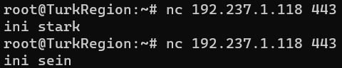
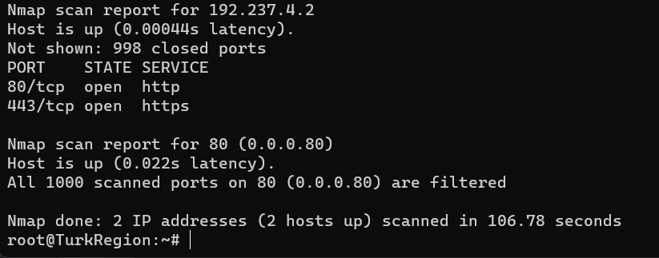
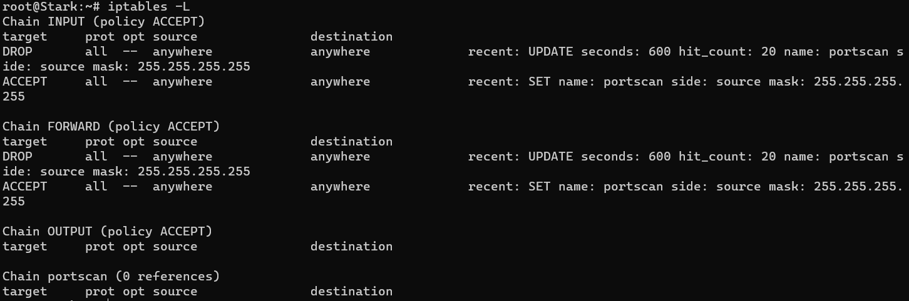
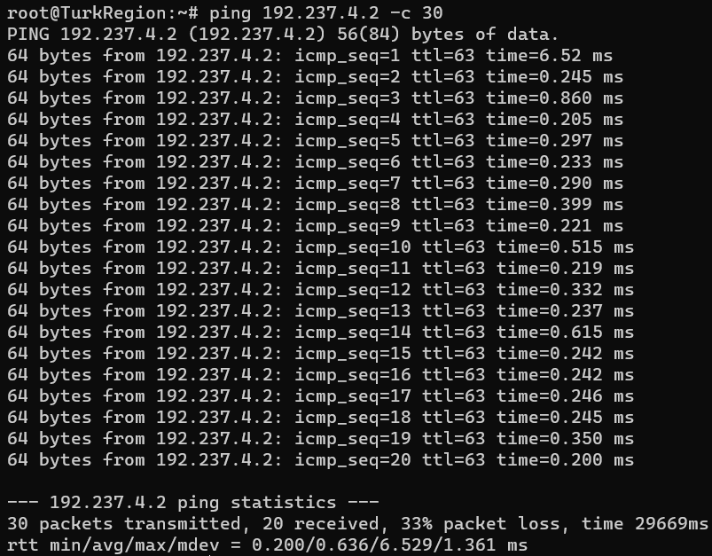

# Praktikum Jaringan Komputer 2023

**Kelompok IT08**

Nama Anggota Kelompok | NRP
------------------- | --------------		
Aqil Sulthan Yuki Maye | 5027211007
Adimas Defatra Bimasena | 5027211040

 Kelompok | Prefix IP 
----------|-----------
 IT08      | 192.237   

## Modul 5

## Daftar Soal :
- [Soal 1](#soal-1)
- [Soal 2](#soal-2)
- [Soal 3](#soal-3)
- [Soal 4](#soal-4)
- [Soal 5](#soal-5)
- [Soal 6](#soal-6)
- [Soal 7](#soal-7)
- [Soal 8](#soal-8)
- [Soal 9](#soal-9)
- [Soal 10](#soal-10)

---

## Topologi


## Subnetting VLSM


## Rute VLSM


## IP VLSM


## Tree VLSM


## Konfigurasi
```
# DNS SERVER (Richter)
echo 'nameserver 192.168.122.1' >/etc/resolv.conf

apt update
apt install netcat -y
apt-get install nmap
```
```
# DHCP SERVER (Revolte)

echo 'nameserver 192.168.122.1' > /etc/resolv.conf

apt update
apt install netcat -y
apt install isc-dhcp-server -y
apt-get install nmap

echo 'INTERFACESv4="eth0"' > /etc/default/isc-dhcp-server

echo '
# option definitions common to all supported networks...
option domain-name "example.org";
option domain-name-servers ns1.example.org, ns2.example.org;

default-lease-time 600;
max-lease-time 7200;

# have support for DDNS.
ddns-update-style none;

# A1
subnet 192.237.4.0 netmask 255.255.252.0 {
  range 192.237.4.2 192.237.7.254;
  option routers 192.237.4.1;
  option broadcast-address 192.237.7.255; 
  option domain-name-servers 192.237.1.110;
  default-lease-time 720;
  max-lease-time 7200;
}

# A2
subnet 192.237.8.0 netmask 255.255.248.0 {
  range 192.237.8.2 192.237.15.254;
  option routers 192.237.8.1;
  option broadcast-address 192.237.15.255;
  option domain-name-servers 192.237.1.110;
  default-lease-time 720;
  max-lease-time 7200;
}

# A7
subnet 192.237.2.0 netmask 255.255.254.0 {
  range 192.237.2.2 192.237.3.254;
  option routers 192.237.2.1;
  option broadcast-address 192.237.3.255;
  option domain-name-servers 192.237.1.110;
  default-lease-time 720;
  max-lease-time 7200;
}

# A8
subnet 192.237.1.128 netmask 255.255.255.128 {
  range 192.237.1.131 192.237.1.254;
  option routers 192.237.1.129;
  option broadcast-address 192.237.1.255;
  option domain-name-servers 192.237.1.110;
  default-lease-time 720;
  max-lease-time 7200;
}

# A3
subnet 192.237.1.124 netmask 255.255.255.252 {}

# A4
subnet 192.237.1.120 netmask 255.255.255.252 {}

# A5
subnet 192.237.1.116 netmask 255.255.255.252 {}

# A6
subnet 192.237.1.112 netmask 255.255.255.252 {}

# A9
subnet 192.237.1.108 netmask 255.255.255.252 {}

# A10
subnet 192.237.1.104 netmask 255.255.255.252 {}
' > /etc/dhcp/dhcpd.conf

service isc-dhcp-server restart
apt-get install nmap
```
```
# DHCP RELAY (Heiter dan Himmel)

echo 'nameserver 192.168.122.1' > /etc/resolv.conf

apt update
apt install netcat -y
apt install isc-dhcp-relay -y

echo '
SERVERS="192.237.1.106"
INTERFACES="eth0 eth1 eth2 eth3"
OPTIONS=""
' > /etc/default/isc-dhcp-relay

nano /etc/sysctl.conf
# uncomment -> net.ipv4.ip_forward=1

service isc-dhcp-relay restart
apt-get install nmap
```
```
# WEB SERVER (Sein dan Stark)

echo 'nameserver 192.168.122.1' > /etc/resolv.conf

apt update
apt install netcat -y
apt-get install nmap
```
```
CLIENT
# IP dari DHCP
apt update
apt install netcat -y
apt-get install nmap
```

## Soal 1
Agar topologi yang kalian buat dapat mengakses keluar, kalian diminta untuk mengkonfigurasi Aura menggunakan iptables, tetapi tidak ingin menggunakan MASQUERADE.
### Penjelasan:
Agar koneksi internet bagi Aura dan node lain bisa terkoneksi tanpa menggunakan Masquerade dapat menggunakan sintaks berikut:
```
IPETH0="$(ip -br a | grep eth0 | awk '{print $NF}' | cut -d'/' -f1)"

iptables -t nat -A POSTROUTING -o eth0 -j SNAT --to-source "$IPETH0" -s 192237.0.0/20
```
- `IPETH0="$(ip -br a | grep eth0 | awk '{print $NF}' | cut -d'/' -f1)"` mengumpulkan IP yang terhubung dengan interface eth0 pada node dengan mengambil nilai IP dari output perintah ip -br a, kemudian menggunakan grep, awk, dan cut untuk mendapatkan nilai IP yang tepat dan menyimpannya dalam variabel IPETH0.
- `iptables -t nat -A POSTROUTING -o eth0 -j SNAT --to-source "$IPETH0" -s 192237.0.0/20` menetapkan aturan pada tabel NAT untuk paket yang keluar melalui interface eth0. Ini menggunakan SNAT untuk mengubah alamat sumber paket-paket tersebut dengan nilai yang ada dalam variabel IPETH0. Aturan ini berlaku hanya untuk paket-paket yang berasal dari subnet 192237.0.0/20, memungkinkan akses internet keluar tanpa menggunakan MASQUERADE.
Berikut hasil testing yang dilakukan pada node Stark


## Soal 2
Kalian diminta untuk melakukan drop semua TCP dan UDP kecuali port 8080 pada TCP.
### Penjelasan:
Untuk menerapkan filter terhadap protokol TCP dan UDP dan memperbolehkan akses hanya pada port 8080, diperlukan definisi IP Address serta port 8080. Berikut adalah perintah shell yang dapat digunakan pada node Revolte untuk melakukan hal tersebut.
```
iptables -A INPUT -p tcp --dport 8080 -j ACCEPT

iptables -A INPUT -p tcp -j DROP

iptables -A INPUT -p udp -j DROP
```
- `iptables -A INPUT -p tcp --dport 8080 -j ACCEPT`: Menerima koneksi TCP yang ditujukan ke port 8080.

- `iptables -A INPUT -p tcp -j DROP`: Menolak semua koneksi TCP kecuali yang menuju port 8080.

- `iptables -A INPUT -p udp -j DROP`: Menolak semua koneksi UDP tanpa pengecualian.<br>
- Tes Berhasil<br>


- Tes Gagal<br>


## Soal 3
Kepala Suku North Area meminta kalian untuk membatasi DHCP dan DNS Server hanya dapat dilakukan ping oleh maksimal 3 device secara bersamaan, selebihnya akan di drop.
### Penjelasan:
Agar bisa membatasi DHCP dan DNS Server hanya dapat dilakukan ping oleh maksimal 3 device secara bersamaan, dapat menggunakan syntax berikut
```
iptables -I INPUT -p icmp -m connlimit --connlimit-above 3 --connlimit-mask 0 -j DROP

iptables -I INPUT -m state --state ESTABLISHED,RELATED -j ACCEPT
```
- `iptables -I INPUT -p icmp -m connlimit --connlimit-above 3 --connlimit-mask 0 -j DROP`: Ini memasukkan aturan pada chain INPUT untuk paket ICMP, menggunakan modul connlimit untuk membatasi jumlah koneksi dengan nilai maksimum 3 (--connlimit-above 3) tanpa mempertimbangkan alamat IP (--connlimit-mask 0). Jika koneksi melebihi batas tersebut, paket ICMP selanjutnya akan ditolak (di-drop).

- `iptables -I INPUT -m state --state ESTABLISHED,RELATED -j ACCEPT`: Ini memasukkan aturan pada chain INPUT untuk menerima (ACCEPT) paket yang memiliki status koneksi sebagai ESTABLISHED atau RELATED. Hal ini memungkinkan paket yang merupakan bagian dari koneksi yang sudah dibuat sebelumnya atau terkait dengan koneksi yang sudah ada diteruskan masuk ke sistem.

Berikut hasil test ping dari 4 client <br>


Terlihat jika client ke-4 tidak bisa melakukan ping dikarenakan Revolte sudah menerima 3 koneksi.

## Soal 4
Lakukan pembatasan sehingga koneksi SSH pada Web Server hanya dapat dilakukan oleh masyarakat yang berada pada GrobeForest.
### Penjelasan:
Untuk server yang berperan sebagai Web Server, yaitu node Sein dan Stark, akan diizinkan akses pada port 22 (SSH). Namun, akses ini akan dibatasi hanya untuk client GrobeForest. Permasalahannya, GrobeForest mendapatkan IP secara dinamis dari DHCP Server dan berada dalam rentang IP 192.237.4.2 hingga 192.237.7.254. Oleh karena itu, aturan firewall perlu dibuat agar GrobeForest tetap bisa mengakses port 22 meskipun IP-nya berganti-ganti dalam rentang tersebut. Sintaks yang digunakan yaitu
```
iptables -A INPUT -p tcp --dport 22 -s 192.237.4.5 -j ACCEPT # pilih berdasarkan range IP Grobeforest

iptables -A INPUT -p tcp --dport 22 -j DROP
```
- `iptables -A INPUT -p tcp --dport 22 -s 192.237.4.5 -j ACCEPT`: Perintah ini menambahkan aturan pada chain INPUT untuk protokol TCP dan tujuan port 22 (SSH) untuk menerima koneksi dari IP spesifik 192.237.4.5, yang merupakan salah satu IP dari GrobeForest. Aturan ini memungkinkan koneksi SSH dari IP yang telah ditentukan (192.237.4.5) ke server pada port 22.

- `iptables -A INPUT -p tcp --dport 22 -j DROP`: Perintah ini menambahkan aturan pada chain INPUT untuk semua koneksi TCP pada port 22 untuk ditolak (DROP). Ini berarti bahwa koneksi SSH dari IP lain, yang tidak termasuk dalam aturan pertama, akan ditolak atau diblokir oleh firewall.
Jika ditest, maka pesan yang dikirim dari sein atau stark hanya bisa diterima oleh client GrobeForest <br>
- Berhasil<br>


- Gagal<br>


## Soal 5
Selain itu, akses menuju WebServer hanya diperbolehkan saat jam kerja yaitu Senin-Jumat pada pukul 08.00-16.00.
### Penjelasan:
Untuk membatasi akses menuju webserver sesuai jam kerja, sintaks yang dapat digunakan seperti berikut
```
iptables -A INPUT -p tcp --dport 22 -s 192.177.4.0/22 -m time --timestart 08:00 --timestop 16:00 --weekdays Mon,Tue,Wed,Thu,Fri -j ACCEPT

iptables -A INPUT -p tcp --dport 22 -j DROP
```
- `iptables -A INPUT -p tcp --dport 22 -s 192.177.4.0/22 -m time --timestart 08:00 --timestop 16:00 --weekdays Mon,Tue,Wed,Thu,Fri -j ACCEPT`: Perintah ini menambahkan aturan pada chain INPUT untuk protokol TCP dan tujuan port 22 (SSH) untuk menerima koneksi dari rentang IP 192.177.4.0 hingga 192.177.7.255 (CIDR /22) pada waktu yang telah ditentukan. Aturan ini memperbolehkan koneksi SSH dari rentang IP tersebut pada hari Senin hingga Jumat antara pukul 08:00 hingga 16:00.

- `iptables -A INPUT -p tcp --dport 22 -j DROP`: Perintah ini menambahkan aturan pada chain INPUT untuk semua koneksi TCP pada port 22 untuk ditolak (DROP). Ini berarti bahwa koneksi SSH dari sumber yang tidak termasuk dalam aturan pertama akan ditolak pada port 22.<br>
- Tes Berhasil <br>


- Tes Gagal <br>


## Soal 6
Lalu, karena ternyata terdapat beberapa waktu di mana network administrator dari WebServer tidak bisa stand by, sehingga perlu ditambahkan rule bahwa akses pada hari Senin - Kamis pada jam 12.00 - 13.00 dilarang (istirahat maksi cuy) dan akses di hari Jumat pada jam 11.00 - 13.00 juga dilarang (maklum, Jumatan rek).
### Penjelasan:
Untuk membatasi akses menuju webserver sesuai rules di atas, sintaks yang dapat digunakan seperti berikut
```
iptables -A INPUT -m time --timestart 12:00 --timestop 13:00 --weekdays Mon,Tue,Wed,Thu -j REJECT

iptables -A INPUT -m time --timestart 11:00 --timestop 13:00 --weekdays Fri -j REJECT
```
- `iptables -A INPUT -m time --timestart 12:00 --timestop 13:00 --weekdays Mon,Tue,Wed,Thu -j REJECT`: Perintah ini menambahkan aturan pada chain INPUT untuk menolak (REJECT) semua koneksi yang masuk pada hari Senin hingga Kamis antara pukul 12:00 hingga 13:00. Artinya, pada rentang waktu tersebut di hari yang ditentukan, tidak ada koneksi yang akan diterima oleh sistem.

- `iptables -A INPUT -m time --timestart 11:00 --timestop 13:00 --weekdays Fri -j REJECT`: Perintah ini menambahkan aturan pada chain INPUT untuk menolak (REJECT) semua koneksi yang masuk pada hari Jumat antara pukul 11:00 hingga 13:00. Ini berarti bahwa pada hari Jumat, koneksi akan ditolak selama rentang waktu yang ditentukan.<br>
- Tes Berhasil <br>


- Tes Gagal <br>


- Tes Gagal (Di jam sholat jumat)<br>


## Soal 7
Karena terdapat 2 WebServer, kalian diminta agar setiap client yang mengakses Sein dengan Port 80 akan didistribusikan secara bergantian pada Sein dan Stark secara berurutan dan request dari client yang mengakses Stark dengan port 443 akan didistribusikan secara bergantian pada Sein dan Stark secara berurutan.
### Penjelasan:
Untuk menjalankan rules diatas dapat mengaktifkan aturan pada iptables di router yang terhubung dengan web server, yaitu himmel dan heiter dengan sintaks berikut.
```
iptables -A PREROUTING -t nat -p tcp --dport 80 -d 192.237.4.2 -m statistic --mode nth --every 2 --packet 0 -j DNAT --to-destination 192.237.4.2
iptables -A PREROUTING -t nat -p tcp --dport 80 -d 192.237.4.2 -j DNAT --to-destination 192.237.1.118
iptables -A PREROUTING -t nat -p tcp --dport 443 -d 192.237.1.118 -m statistic --mode nth --every 2 --packet 0 -j DNAT --to-destination 192.237.1.118
iptables -A PREROUTING -t nat -p tcp --dport 443 -d 192.237.1.118 -j DNAT --to-destination 192.237.4.2
```
 <br>
Setelah melakukan iptables, uji coba dapat dilakukan dengan membuka koneksi pada web server, yakni Sein dan Stark, menggunakan sintaks berikut di port 80
```
Port 80
while true; do nc -l -p 80 -c 'echo "ini sein"'; done #sein
while true; do nc -l -p 80 -c 'echo "ini stark"'; done #stark
```
Untuk port 443, dapat menggunakan sintaks berikut
```
Port 443
while true; do nc -l -p 443 -c 'echo "ini sein"'; done #sein
while true; do nc -l -p 443 -c 'echo "ini stark"'; done #stark
```
Dengan cara ini, dapat diuji coba apakah koneksi terbuka dengan benar pada port yang diinginkan untuk server Sein dan Stark melalui client.
- Port 80 <br>
<br>
- Port 443 <br>


## Soal 8
Karena berbeda koalisi politik, maka subnet dengan masyarakat yang berada pada Revolte dilarang keras mengakses WebServer hingga masa pencoblosan pemilu kepala suku 2024 berakhir. Masa pemilu (hingga pemungutan dan penghitungan suara selesai) kepala suku bersamaan dengan masa pemilu Presiden dan Wakil Presiden Indonesia 2024.
### Penjelasan:
Untuk menjalankan rules diatas dapat mengaktifkan aturan pada iptables dengan sintaks berikut di sein dan stark
```
iptables -A INPUT -p tcp --dport 80 -s 192.237.1.104/30 -m time --datestart 2023-12-10 --datestop 2024-02-15 -j DROP
```
Aturan ini menambahkan pada chain INPUT aturan iptables untuk protokol TCP dan tujuan port 80. Koneksi dari rentang IP 192.237.1.104/30 akan ditolak (DROP) antara tanggal 10 Desember 2023 hingga 15 Februari 2024. Hal ini mengakibatkan koneksi dari rentang IP tersebut pada port 80 akan diblokir selama periode waktu yang telah ditentukan.<br>

- Tes Turk Region (Berhasil)<br>
<br>
- Tes Revolte (Gagal)<br>
<br>
- Tes Revolte (Berhasil)<br>
</br>

## Soal 9
Sadar akan adanya potensial saling serang antar kubu politik, maka WebServer harus dapat secara otomatis memblokir  alamat IP yang melakukan scanning port dalam jumlah banyak (maksimal 20 scan port) di dalam selang waktu 10 menit. (clue: test dengan nmap)
### Penjelasan:
Adapun penyelesaian rules diatas dapat mengaktifkan aturan pada iptables dengan sintaks berikut di sein dan stark
```
iptables -N portscan

iptables -A INPUT -m recent --name portscan --update --seconds 600 --hitcount 20 -j DROP

iptables -A FORWARD -m recent --name portscan --update --seconds 600 --hitcount 20 -j DROP

iptables -A INPUT -m recent --name portscan --set -j ACCEPT

iptables -A FORWARD -m recent --name portscan --set -j ACCEPT
```
`iptables -N portscan`: Membuat sebuah chain baru yang disebut "portscan".

`iptables -A INPUT -m recent --name portscan --update --seconds 600 --hitcount 20 -j DROP`: Menetapkan aturan pada chain INPUT untuk menolak paket-paket yang masuk jika ada 20 atau lebih koneksi dalam waktu 600 detik ke port yang sama. Ini bertujuan untuk melindungi dari serangan port scanning dengan menolak koneksi jika ambang batas tersebut tercapai.

`iptables -A FORWARD -m recent --name portscan --update --seconds 600 --hitcount 20 -j DROP`: Sama seperti aturan sebelumnya, namun ditujukan untuk paket yang dilalui melalui chain FORWARD.

`iptables -A INPUT -m recent --name portscan --set -j ACCEPT`: Mengatur aturan pada chain INPUT untuk mengizinkan (ACCEPT) paket-paket yang memicu aturan jika koneksi tidak melebihi ambang batas yang ditetapkan.

`iptables -A FORWARD -m recent --name portscan --set -j ACCEPT`: Sama seperti aturan sebelumnya, namun ditujukan untuk mengizinkan paket-paket yang dilalui melalui chain FORWARD jika koneksi tidak melebihi ambang batas yang ditetapkan.
<br>
Jika ditest, maka client tidak bisa melakukan scanning port lebih dari 20 scanning port.
<br>

## Soal 10
Karena kepala suku ingin tau paket apa saja yang di-drop, maka di setiap node server dan router ditambahkan logging paket yang di-drop dengan standard syslog level.
### Penjelasan:
Untuk melakukan logging paket yang di-drop, dapat menambahkan sintaks berikut
```
iptables -A INPUT  -j LOG --log-level debug --log-prefix 'Dropped Packet' -m limit --limit 1/second --limit-burst 10
```
Perintah ini menambahkan aturan pada chain INPUT untuk mencatat pesan log setiap kali ada paket yang ditolak (DROP) oleh firewall dengan level debug. Pesan log ini akan memiliki awalan 'Dropped Packet'. Selain mencatat log, perintah juga membatasi jumlah pesan log yang dicatat dengan batas satu pesan per detik dan puncak burst sebanyak 10 pesan.<br>
Untuk melakukan logging kami melakukan port scanning, hal yang sama dengan no 9, lalu mengecek hasil log di `iptables -L`<br>


## Resmi Menamatkan Praktikum Jarkom 🙏🙏🙏
